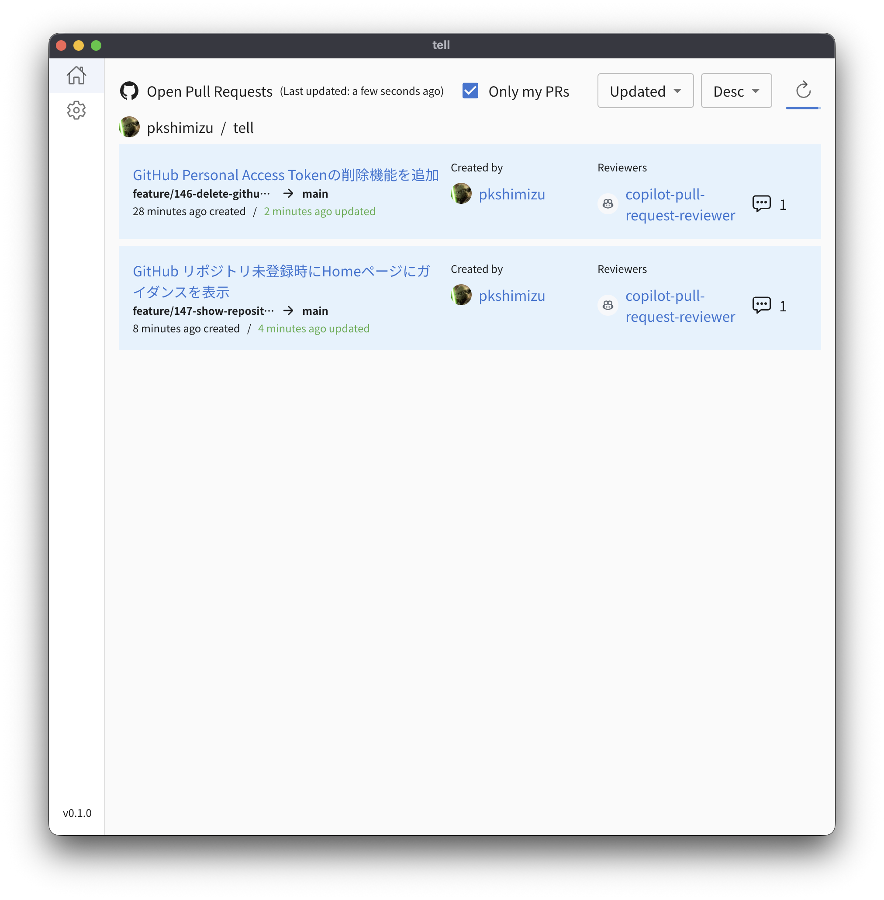
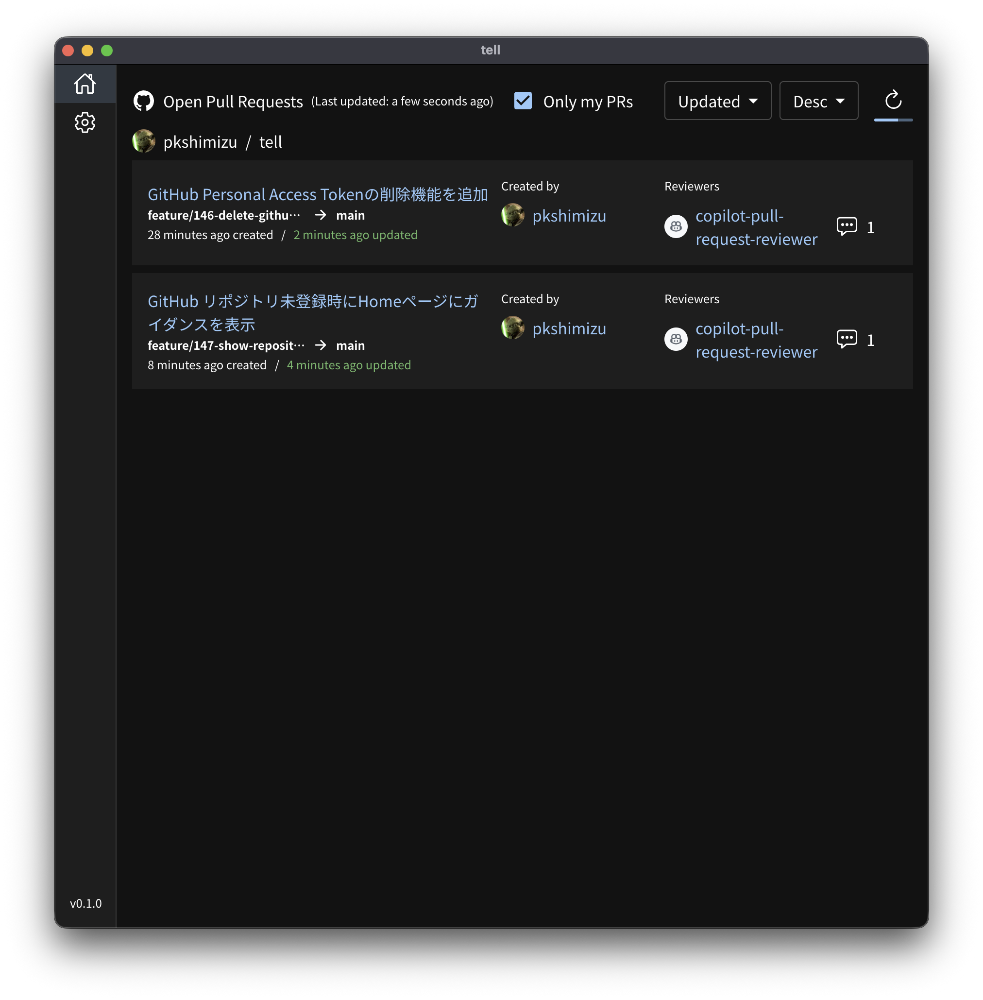

# tell

<div align="center">
  
  <h3>Your Personal GitHub Assistant</h3>
  <p>tell automatically collects and monitors information that matters to you from GitHub</p>
</div>

## ✨ Features

tell is a desktop application that helps you stay on top of your GitHub activities without constantly checking your browser.

### 📋 Main Features

- **📊 Pull Request Dashboard**: View all open pull requests at a glance
- **🔄 Real-time Updates**: Automatically refreshes with configurable intervals (1-15 minutes)
- **👤 Smart Filtering**: See only PRs where you're involved (author, assignee, or reviewer)
- **🏢 Multi-Repository Support**: Monitor multiple repositories from different organizations
- **🔀 Sorting Options**: Sort PRs by creation date, update date, or author
- **✅ Check Status Display**: View CI/CD check results directly in the PR list
- **🌿 Branch Information**: See source and target branch names for each PR
- **⏰ Time-based Coloring**: Visual indicators for PR update times
- **🌙 Dark/Light Mode**: Switch between themes or follow system preference
- **💾 Window State Persistence**: Remember window position and size across sessions
- **🎯 Onboarding Guide**: Helpful guidance for new users to get started

## 📸 Screenshots

### Light Mode



### Dark Mode



## 📥 Installation

### Prerequisites

- [Node.js](https://nodejs.org/) 20 or later
- [Git](https://git-scm.com/)

### Build from Source

1. **Clone the repository**

   ```bash
   git clone https://github.com/pkshimizu/tell.git
   cd tell
   ```

2. **Install dependencies**

   ```bash
   npm install
   ```

3. **Build for your platform**

   ```bash
   # For Windows
   npm run build:win

   # For macOS
   npm run build:mac
   ```

4. **Run the application**
   - **Windows**: Run `dist/tell-{version}-win.exe`
   - **macOS**: Open `dist/mac-universal/tell.app`

## 🚀 Getting Started

### Initial Setup

1. **Launch tell** from your applications menu
2. **Configure GitHub Integration**:
   - Click on the Settings icon in the sidebar
   - Navigate to GitHub settings

### GitHub Personal Access Token Setup

To use tell, you need to create a GitHub Personal Access Token:

1. **Go to GitHub Settings**:
   - Click your profile picture on GitHub
   - Select "Settings" → "Developer settings" → "Personal access tokens" → "Tokens (classic)"

2. **Create New Token**:
   - Click "Generate new token" → "Generate new token (classic)"
   - Give your token a descriptive name (e.g., "tell Desktop App")
   - Select expiration (we recommend 90 days for security)
   - Select the following scopes:
     - `repo` (Full control of private repositories)
     - `read:org` (Read org and team membership)
     - `read:user` (Read user profile data)

3. **Copy the Token**:
   - Copy the generated token immediately (you won't be able to see it again)
   - Paste it into tell's GitHub settings

4. **Select Repositories**:
   - Choose which repositories you want to monitor
   - tell will start fetching pull request information

### Using tell

#### Viewing Pull Requests

- The home screen displays all open pull requests from your selected repositories
- PRs are grouped by repository for easy navigation
- Each PR shows:
  - Title and creation/update times
  - Author information
  - Assignees
  - Reviewers with their review status

#### Filtering and Sorting Options

- **"Only my PRs"**: Toggle this to see only PRs where you're involved
- **Sort by**: Choose to sort by creation date, update date, or author
- **Sort order**: Switch between ascending and descending order
- **Refresh**: Manually refresh the PR list at any time
- **Auto-reload indicator**: Progress bar shows time until next automatic refresh

#### Theme Settings

- Navigate to Settings to switch between Light mode, Dark mode, or System preference

#### Token Management

- **Update Token**: Update your Personal Access Token when it expires
- **Delete Account**: Remove a GitHub account from tell when needed

## 🔧 Troubleshooting

### Common Issues

#### "Authentication Failed" Error

- If your token has expired, tell will prompt you to update it
- Click "Update Token" in the dialog or go to Settings → GitHub
- Ensure the token has the required permissions
- You can also delete and re-add the account if needed

#### Pull Requests Not Showing

- Check that repositories are selected in settings
- Verify you have access to the repositories
- Try clicking the refresh button

#### Application Won't Start

- **Windows**: Check Windows Defender or antivirus settings
- **macOS**: Allow the app in System Preferences → Security & Privacy

### Getting Help

If you encounter issues:

1. Check the [FAQ](https://github.com/pkshimizu/tell/wiki/FAQ)
2. Search [existing issues](https://github.com/pkshimizu/tell/issues)
3. Create a [new issue](https://github.com/pkshimizu/tell/issues/new) with details about your problem

## 🤝 Contributing

We welcome contributions! If you're interested in improving tell, please see our [Contributing Guide](CONTRIBUTING.md) for development setup and guidelines.

## 📝 License

tell is open source software licensed under the MIT License. See the LICENSE file for more details.

## 🙏 Acknowledgments

- Built with [Electron](https://www.electronjs.org/), [React](https://react.dev/), and [TypeScript](https://www.typescriptlang.org/)
- Icons from [React Icons](https://react-icons.github.io/react-icons/)
- UI components powered by [Material-UI](https://mui.com/)

---

<div align="center">
  Made with ❤️ by the tell team
  <br>
  <a href="https://github.com/pkshimizu/tell">GitHub</a> •
  <a href="https://github.com/pkshimizu/tell/issues">Issues</a> •
  <a href="https://github.com/pkshimizu/tell/discussions">Discussions</a>
</div>
